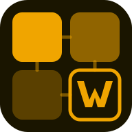

<div align="center">



# NEXUS Watcher

**Docker image update detection for the NEXUS Ecosystem**

[](https://hub.docker.com/r/afraguas1983/nexus-watcher)
[](https://hub.docker.com/r/afraguas1983/nexus-watcher)
[](LICENSE)
[](https://hub.docker.com/_/node)

[Docker Hub](https://hub.docker.com/r/afraguas1983/nexus-watcher) · [NEXUS Ecosystem](https://github.com/Alvarito1983/NEXUS) · [Report Bug](https://github.com/Alvarito1983/nexus-watcher/issues)

</div>

---

## What is NEXUS Watcher?

NEXUS Watcher monitors your Docker images and detects when newer versions are available in the registry — using **SHA256 digest comparison**, not just tag names. This means it catches updates even when the tag stays the same (e.g. `latest`).

It works **standalone** or as part of the **NEXUS Ecosystem**, where it integrates seamlessly with NEXUS, NEXUS Notify and NEXUS OS.

### Key features

- **Digest-based detection** — compares local SHA256 vs registry, catches `latest` updates
- **Two scan modes** — notify only, or auto-update with container recreation
- **Rollback support** — saves previous digest before updating, one-click restore
- **Configurable interval** — 1h, 3h, 6h, 12h or 24h, changeable from the UI without restart
- **Telegram notifications** — alerts when updates are found or applied
- **Full EN/ES i18n** — English and Spanish UI
- **REST API** — all features accessible via authenticated API
- **NEXUS Ecosystem ready** — registers with NEXUS OS, routes events to NEXUS Notify

---

## Part of the NEXUS Ecosystem

```
NEXUS OS              — Unified dashboard & SSO
├── NEXUS             — Docker manager          :9090
├── NEXUS Watcher     — Update detection        :9091  ← you are here
├── NEXUS Pulse       — Uptime & health         :9092
├── NEXUS Security    — CVEs & audit            :9093
├── NEXUS Notify      — Alert router            :9094
└── NEXUS Proxy       — Docker socket proxy     :2375
```

Each tool works standalone. Together, they think.

---

## Quickstart

```bash
# Pull and run
docker run -d \
  --name nexus-watcher \
  -p 9091:3002 \
  -v /var/run/docker.sock:/var/run/docker.sock \
  -e ADMIN_PASSWORD=yourpassword \
  afraguas1983/nexus-watcher:latest
```

Or with Docker Compose:

```bash
git clone https://github.com/Alvarito1983/nexus-watcher.git
cd nexus-watcher
cp .env.example .env
# Edit .env with your credentials
docker compose up -d --build
```

Open **http://localhost:9091** — default credentials: `admin` / `admin`

---

## Configuration

| Variable | Default | Description |
|----------|---------|-------------|
| `PORT` | `3002` | Backend port |
| `ADMIN_USER` | `admin` | Login username |
| `ADMIN_PASSWORD` | `admin` | Login password |
| `NEXUS_API_KEY` | — | Shared ecosystem API key |
| `SCAN_INTERVAL` | `3600` | Seconds between scans (overridden by UI settings) |
| `NEXUS_URL` | — | NEXUS integration URL |
| `NOTIFY_URL` | — | NEXUS Notify webhook URL |
| `TELEGRAM_BOT_TOKEN` | — | Telegram bot token for alerts |
| `TELEGRAM_CHAT_ID` | — | Telegram chat ID |
| `GHCR_TOKEN` | — | GitHub token for private GHCR images |

All notification settings can also be configured directly from the **Settings** tab in the UI.

---

## REST API

All endpoints require `Authorization: Bearer <token>` header (except `/health` and `/status`).

| Method | Endpoint | Description |
|--------|----------|-------------|
| `GET` | `/health` | Liveness check |
| `GET` | `/status` | Summary: images, pending updates, last scan |
| `GET` | `/metrics` | Prometheus-compatible metrics |
| `GET` | `/api/images` | All tracked images with local and registry digests |
| `GET` | `/api/images/:id` | Single image detail |
| `GET` | `/api/updates` | Images with updates available |
| `POST` | `/api/updates/:id/apply` | Pull new image and recreate containers |
| `POST` | `/api/updates/apply-all` | Bulk update all pending images |
| `POST` | `/api/updates/apply-all?dryRun=true` | Preview without applying |
| `POST` | `/api/updates/:id/rollback` | Restore previous image digest |
| `POST` | `/api/scan` | Trigger manual scan |
| `GET` | `/api/scan/history` | Last N scan results |
| `DELETE` | `/api/scan/history` | Clear scan history |
| `GET` | `/api/settings` | Get current configuration |
| `POST` | `/api/settings` | Update configuration (hot reload) |
| `POST` | `/api/auth/login` | Get session token |

---

## How it works

```
1. On startup → list all local images via Docker API
2. For each image → fetch Docker-Content-Digest from registry
3. Compare with last known digest
4. If different → mark as update available
5. Notify via Telegram / NEXUS Notify
6. If auto-update mode → pull + recreate containers
7. Repeat every SCAN_INTERVAL seconds
```

Registry auth is handled automatically for public Docker Hub images. For private images or GHCR, set `GHCR_TOKEN`.

---

## Screenshots

| Dashboard | Settings |
|-----------|----------|
| Updates list with digest comparison | Scan interval, auto-update mode, Telegram |

---

## Development

```bash
# Backend
cd backend
npm install
npm run dev      # node --watch server.js on :3002

# Frontend (separate terminal)
cd frontend
npm install
npm run dev      # Vite dev server on :9091 with proxy to :3002
```

---

## Tech stack

- **Backend** — Node.js 24, Express, Dockerode, node-cron
- **Frontend** — React 18, Vite
- **Base image** — `node:24-alpine`
- **Registry auth** — Docker Hub token API, GHCR bearer token

---

## NEXUS Ecosystem

| Project | Description |
|---------|-------------|
| [NEXUS](https://github.com/Alvarito1983/NEXUS) | Docker container manager |
| **NEXUS Watcher** | Update detection ← this |
| NEXUS Pulse | Uptime & health monitoring *(coming Q3 2026)* |
| NEXUS Security | CVE scanning & audit *(coming Q3 2026)* |
| NEXUS Notify | Unified alert router *(coming Q2 2026)* |
| NEXUS OS | Unified ecosystem dashboard *(coming Q4 2026)* |

---

<div align="center">

Made with ☕ by [Alvarito1983](https://github.com/Alvarito1983)

</div>
